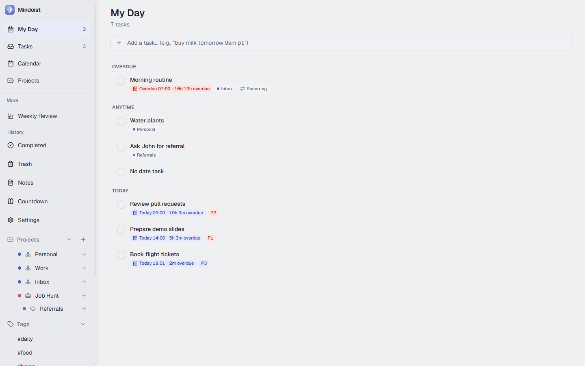
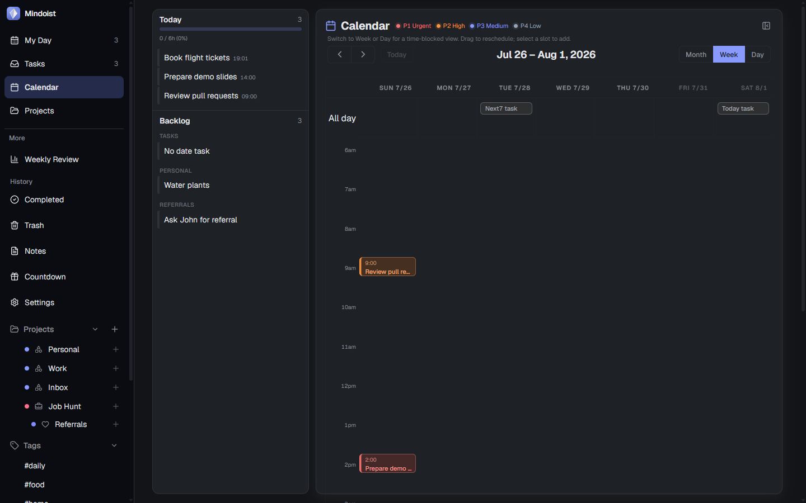

<div align="center">


# Mindoist

**A modern, bilingual task manager with smart lists, calendar sync, offline support, and Kanban workspaces.**

[](LICENSE)
[](https://www.typescriptlang.org/)
[](https://react.dev/)
[](https://www.fastify.io/)
[](https://www.postgresql.org/)

</div>

---

## Screenshots

<p align="center">
  
  
</p>

---

## Features

### Core
- **Task Management** — Create, edit, complete, and delete tasks with priorities (P1–P4), due dates, tags, and descriptions
- **Quick Add** — Natural language input that parses dates and times in English and Vietnamese
- **Recurring Tasks** — RFC 5545 RRULE support with automatic next-occurrence generation
- **Smart Lists** — Today, Upcoming, Overdue, and Completed views with real-time filtering
- **Global Search** — Fuzzy search across task titles and descriptions

### Projects & Workspaces
- **Kanban Board** — Drag-and-drop tasks across customizable columns
- **Sub-Projects** — Hierarchical project tree with parent/child relationships
- **Project Templates** — Predefined column layouts for Daily Log, Job, Personal, or Custom workflows
- **Task Inspector** — Slide-out detail panel with inline editing, Pomodoro timer, and due countdown

### Calendar & Sync
- **FullCalendar Integration** — Month, Week, and Day views with drag-to-reschedule
- **Google Calendar Sync** — One-way push (task → event) and read-only pull of existing events
- **Priority Color Coding** — Events colored by task priority with a legend bar

### Offline & PWA
- **Offline-First** — IndexedDB cache via Dexie with automatic background sync
- **Conflict Resolution** — Last-write-wins with cursor-based change tracking
- **Web Push Notifications** — VAPID-based reminders via pg-boss scheduler
- **Service Worker** — Workbox-powered caching for installability

### Polish
- **Bilingual** — Full English and Vietnamese localization with automatic language detection
- **Dark Mode** — System-aware with manual toggle and 8 accent color presets
- **Responsive** — Desktop sidebar, tablet drawer, mobile bottom navigation
- **Keyboard Shortcuts** — Quick add, navigation, and command palette
- **Import** — TickTick CSV import with dry-run preview

### Analytics
- **Summary Dashboard** — Task completion stats, trend charts, priority breakdowns, and project distribution
- **Summary Calendar** — Monthly overview with day agenda sidebar

---

## Tech Stack

| Layer | Technology |
|---|---|
| **Frontend** | React 19, Vite 6, Tailwind CSS v4, Framer Motion, FullCalendar 6, Dexie 4 |
| **Backend** | Fastify 5, Prisma 6, Zod, pg-boss, jsonwebtoken |
| **Database** | PostgreSQL 16 |
| **Shared** | TypeScript 5.8, chrono-node, rrule |
| **Infra** | Docker Compose, pnpm workspaces, Vitest, Playwright |

---

## Getting Started

### Prerequisites

- [Node.js](https://nodejs.org/) ≥ 20
- [pnpm](https://pnpm.io/)
- [Docker](https://www.docker.com/) (for PostgreSQL)

### Installation

```bash
# Clone the repository
git clone https://github.com/your-username/mindoist.git
cd mindoist

# Start PostgreSQL
docker compose up -d

# Install dependencies
pnpm install

# Set up environment variables
cp .env.example apps/api/.env
# Edit apps/api/.env — set JWT_SECRET to a secure random string

# Run database migrations
pnpm --filter api prisma migrate deploy

# Seed the database (optional — creates demo user + sample data)
pnpm --filter api prisma db seed
```

### Development

```bash
pnpm dev
```

| Service | URL |
|---|---|
| Web (Vite) | http://localhost:5173 |
| API (Fastify) | http://localhost:3000 |

### Test

```bash
# Unit tests (Vitest)
pnpm test

# E2E tests (Playwright) — create and migrate the test database first
# (mindoist_test, see playwright.config.ts), then:
pnpm e2e

# Type check
pnpm lint
```

### Build

```bash
pnpm build
```

### Deploy (Docker)

`docker-compose.prod.yml` runs the API + web + PostgreSQL — the server only needs Docker, no Node/pnpm install.

```bash
# On the server, with the repo checked out:
cp .env.example .env
# Edit .env — set POSTGRES_PASSWORD, JWT_SECRET, DOMAIN (and GOOGLE_CLIENT_ID/SECRET if using Google integration)

docker compose -f docker-compose.prod.yml --env-file .env up -d --build
```

Database migrations run automatically when the `api` container starts. Both services speak plain HTTP: the API on `${API_PORT:-3000}`, the web app (`vite preview` serving the built SPA, no bundled web server) on `${WEB_PORT:-5174}`. Neither terminates TLS itself — point your own reverse proxy (Caddy/Nginx/Cloudflare) at both ports under the same domain, routing API paths (`/auth`, `/tasks`, `/projects`, ... — see `apiRoutes` in `apps/web/vite.config.ts`) to the `api` port and everything else to the `web` port, since the frontend calls the API with relative paths (`VITE_API_URL` unset).

---

## Project Structure

```
mindoist/
├── apps/
│   ├── api/              # Fastify backend + Prisma
│   │   ├── src/          # Routes, middleware, services
│   │   └── prisma/       # Schema, migrations, seed
│   └── web/              # React frontend
│       ├── src/
│       │   ├── components/   # UI components (30+)
│       │   ├── hooks/        # useAuth, useApi, useKeyboardShortcuts
│       │   ├── lib/sync/     # Offline sync engine
│       │   ├── i18n/         # EN + VI locale files
│       │   └── pages/        # Login, Register
│       └── e2e/          # Playwright end-to-end tests
├── packages/
│   └── shared/           # Shared types, NL parser, recurrence utils
├── docs/                 # Design docs, plans, test reports
├── docker-compose.yml    # PostgreSQL 16
└── pnpm-workspace.yaml
```

---

## API Endpoints

| Method | Path | Description |
|---|---|---|
| POST | `/auth/register` | Create account |
| POST | `/auth/login` | Sign in (returns JWT) |
| GET | `/auth/me` | Current user |
| CRUD | `/tasks`, `/projects`, `/sections`, `/tags`, `/notes` | Resource management |
| PATCH | `/tasks/:id/complete` | Complete a task |
| PATCH | `/tasks/:id/move` | Move task to column |
| GET | `/tasks/smart/:filter` | Smart list (today/upcoming/overdue) |
| GET | `/sync/changes` | Pull offline changes |
| POST | `/sync/push` | Push offline mutations |
| GET | `/gcal/events` | Google Calendar events |
| POST | `/gcal/connect` | Start Google OAuth |
| GET | `/health` | Health check |

---

## Environment Variables

| Variable | Required | Description |
|---|---|---|
| `DATABASE_URL` | Yes | PostgreSQL connection string |
| `JWT_SECRET` | Yes | Secret key for JWT signing |
| `PORT` | No | API server port (default: `3000`) |
| `GOOGLE_CLIENT_ID` | No | Google OAuth client ID |
| `GOOGLE_CLIENT_SECRET` | No | Google OAuth client secret |
| `GOOGLE_REDIRECT_URI` | No | OAuth callback URL (Google Calendar) |
| `GOOGLE_AUTH_REDIRECT_URI` | No | OAuth callback URL (sign-in with Google) |
| `FRONTEND_URL` | No | Where to redirect after OAuth completes (default: `http://localhost:5173`) |

`docker-compose.prod.yml` only:

| Variable | Required | Description |
|---|---|---|
| `DOMAIN` | Yes | Public domain (no scheme) — used to build the OAuth redirect URLs above |
| `POSTGRES_USER` / `POSTGRES_DB` | No | Defaults: `mindoist_user` / `mindoist_db` |
| `WEB_PORT` | No | Host port for the `web` container (default: `5174`) |

---

## License

MIT
